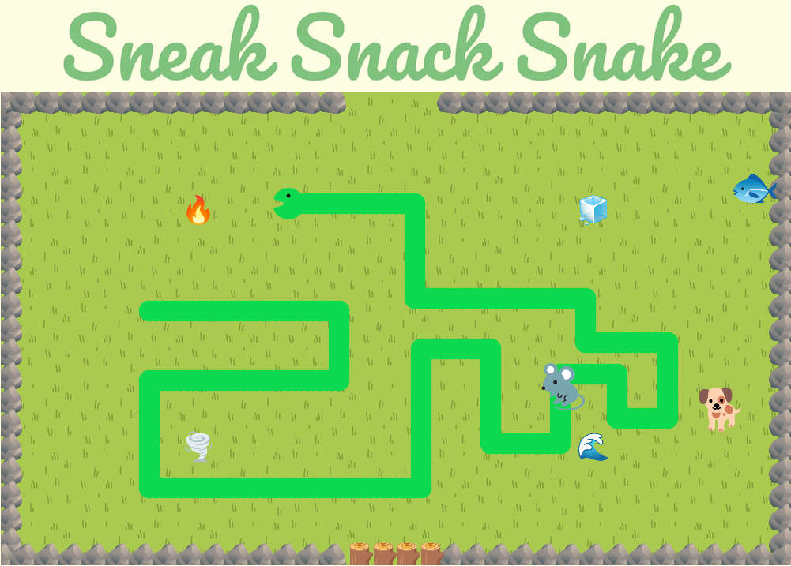

<h1>Sneak Snack Snake</h1>

Thisss isss my sssnake game. 🐍 Pleassse read before playing. 
<a href="https://cb299792458.github.io/snacke/">Play Here</a>

You're a sneaky snacking snake, and your goal is to use WASD controls to move around each level, eating all of the other delicious animal snacks in order to grow big and strong. Crashing into obstacles or yourself will end the game, which is harder and harder as you get longer. However, you are what you eat, and eating certain snacks will give you special powers. Some of these powers will be passively available, but others will need to be activated by making specific movements. (You don't have arms or legs 😅) Once you've eaten enough snacks and filled your stomach, you win!

As you play through the game, levels will get harder, in the form of obstacles such as water. To handle this, eating certain amounts of certain animals will make your snake stronger. For instance, eating a few fish in the same level will allow your snake to swim through water. 

The game will be hosted online, with highscores saved globally using Firebase. A single html page will store all necessary information.

Thanks to all of these games and their creators for inspiration: Snake, Slither.io, Slay the Spire, One Step from Eden, Peglin, Roundguard, SNKRX, Crypt of the Necrodancer, Super Auto Pets, Unrailed, Enter the Gungeon, and many more.

No thanks to League of Legends for being a cesspool of toxicity and frustration, and causing generations of gamers to hemorrhage time and money into a bottomless pit of pain and despair.

<h2>Obstacles</h2>
<ul>
    <li> Water: Hurts the snake, unless fish perk is active </li>
    <li> Ice: Freezes the snake, temporarily preventing turning </li>
    <li> Tornado: Randomly turns the snake, with a short cooldown </li>
    <li> Fire: Hurts the snake, can't be prevented </li>
</ul>

<h2>Powerups</h2>
There are three types of powerups, Rewards, Perks, and Abilities. All three are activated by having three of the same animal in the stomach at the same time. None of them stack, only one instance can be held at a time.   

<h3>Rewards</h3>
These powerups grant bonuses once the current level is complete
<ul>
    <li>Cats have nine lives. You can have an extra.
    <li>Dogs fetch extra points based on level.
</ul>

<h3>Perks</h3>
These powerups grant temporary bonuses while held
<ul>
    <li>Rats will eat anything. More snacks will appear.
    <li>Fish have gills and they can swim. You can too.
    <li>Pigs love to eat. Doubles your stomach size.
    <li>Rabbits are prolific. Activate bonuses more easily.
</ul>

<h3>Abilities</h3>
These powersups can be activated using movements while held
<ul>
    <li>DLC
</ul>

<!-- 
PERKS:
monkey: activacte abilities more easily

ABILITIES:
frog: extends tongue to eat food at long range
mole: burrows underground, invincible but cannot eat/turn
lizard: shortens your snake by removing tail
snail: temporarily slow down snake
beaver: remove a water obstacle

PASSIVE
squirrel: allows adding a snack to menu
raccoon: allows removing a snack from menu -->

<h2>Special Thanks</h2>
<ul>
    <li>Ayce, Kin, Peter, and Spencer
    <li>Clarence, Ivy, William, any many others
    <li>keymaster.js, Canvas API, Firebase
    <li>https://www.favicon.cc/?action=icon&file_id=968880
    <li>https://fonts.google.com/noto/specimen/Noto+Color+Emoji
    <li>https://cainos.itch.io/pixel-art-top-down-basic
    <li>https://www.fmbeats.kiwi/#house
    <li>https://app.logo.com/
</ul>